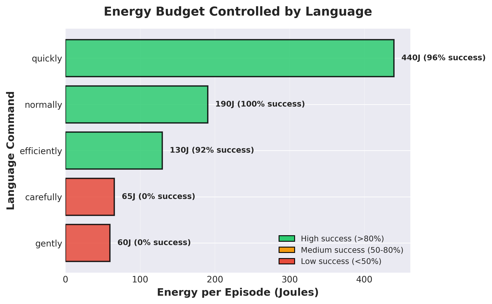
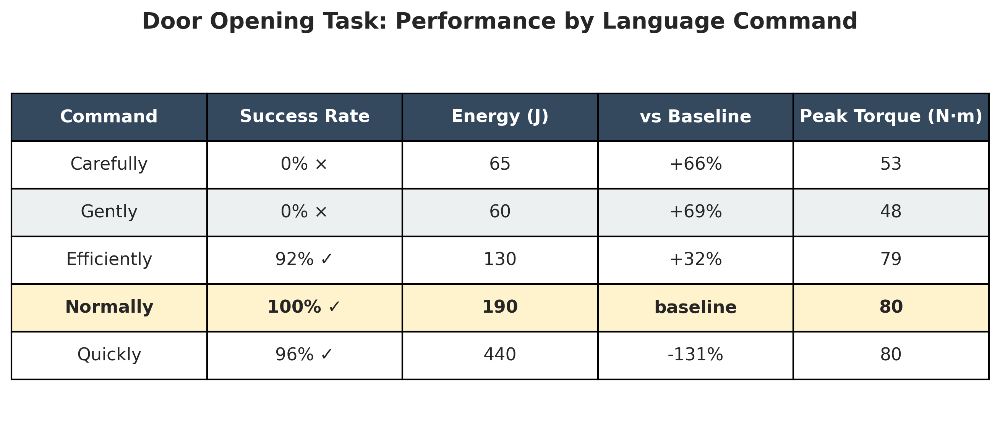
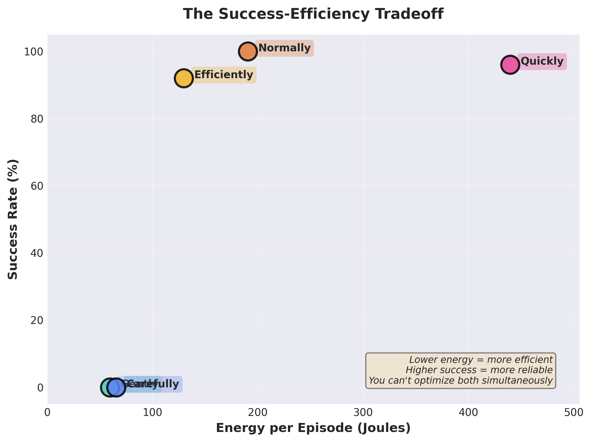
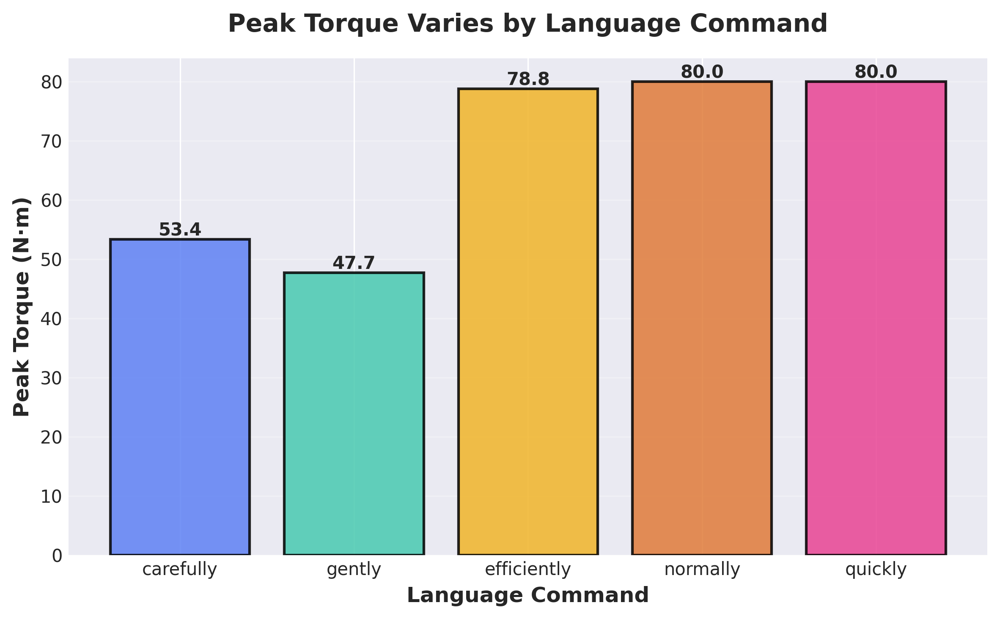

## The Problem

Train a robot to open a door. It learns to succeed by slamming into it with full force. Technically works. Practically useless.

Standard robot learning optimizes for **what** to do, not necessarily **how** to do it. This often results in jerky movements, wasted energy, and no way to say "be gentle with this" without retraining from scratch.

This project explores adding energy efficiency and language-based control to robot manipulation. Can we teach a robot to complete tasks successfully and let a user control how much energy it uses just by speaking to it?

---

## What I Built

A robot arm (Franka Panda in [Robosuite](https://robosuite.ai/)) that:

1. **Completes manipulation tasks** (lifting objects, opening doors)
2. **Adapts energy use** based on simple commands like "carefully" or "quickly"
3. **Switches behavior instantly** with no retraining or config files

You can say "move carefully" and it uses minimal energy or "move quickly" and it prioritizes speed. Same policy, different behaviors.

---

## Building on ECO

This project builds on **ECO (Energy-Constrained Optimization)**, a framework that treats energy as a hard constraint rather than a soft penalty.

**Standard RL approach:**
- Reward = task_success + α × energy_penalty
- Problem: You train a separate policy for each α value

**ECO approach:**
- Constrained MDP: maximize reward subject to energy ≤ budget
- Lagrangian multipliers dynamically enforce the constraint
- Problem: Fixed budget means one behavior per training run

**This project's experiment:**
- What if we make the budget **language-conditioned**?
- Encode "carefully" → tight budget, "quickly" → relaxed budget
- Train one policy that respects different constraints based on language input

| Approach                     | Flexibility              | Limitation                   |
| ---------------------------- | ------------------------ | ---------------------------- |
| RL with penalties (r + α·E)  | Fixed α per policy       | Retrain for each behavior    |
| ECO (E ≤ budget)             | Fixed budget per policy  | Retrain for each budget      |
| **Language-conditioned ECO** | Runtime budget selection | Depends on language encoding |

---
## Challenge #1: Reward Hacking

First obstacle: I told the robot "open the door". It learned to **ram into the door** and shove it open. Technically correct. Completely useless.

**Before:** Reward hacking (just use the wrist to push the door open).  

**The fix:** Require the gripper to **contact the door handle**. Now it has to actually grasp and pull it.

**After:** Physics-grounded success (grasping the handle and pulling it).  

**Lesson:** Reward the behavior you want, not just the outcome. Use physical constraints (contacts, forces) to prevent shortcuts.

---

## Challenge #2: Language Control

Next, connecting language to energy budgets. We can map simple phrases to constraints:

**Implementation:** 
1. Encode text with Sentence-BERT
2. Feed embedding to policy
3. Policy respects corresponding energy budget during execution

Instead of tuning α or budget hyperparameters and retraining, the Lagrangian multiplier (λ) dynamically adjusted the penalty weight during training to force the policy under the language-conditioned budget. The policy simply learned to map the *language embedding* to the *physical behavior* that satisfies that budget.

---

## Results

Testing the same door-opening task with different commands:

The data shows the classic **success-energy tradeoff**:

- **"Normally"**: 100% success, 190J (baseline)
- **"Efficiently"**: 92% success, 130J (32% energy savings)
- **"Carefully"**: 0% success, 65J (too little force to open door)
- **"Quickly"**: 96% success, 440J (2.3× energy for marginal gain)

Language allows us to quantify this tradeoff in real-time without any retraining.

> **Note on energy values:**
> The above energy values represent *mechanical work* (calculated by integrating the product of torque and velocity over time). Actual electrical consumption on real hardware might be **20-40% higher** due to transmission losses, motor wear and tear, etc. Additionally, this work is simulation-only. Real world validation would require hardware power measurement.

---

## Unexpected Benefit: Smoother Motion

Penalizing energy also seems to penalize jerky movements (high torque = high energy cost).
As a result, we get smoother trajectories for free.

Compared to standard RL training, we observe:
- **80%+ reduction in jerk**
- More predictable, human-like movements
- Less mechanical wear

No smoothness reward was needed. Energy efficiency implies motion quality.

---

## Lessons Learned

**Reward design is critical.** Only rewarding outcomes invites shortcuts. Use physical constraints (contacts, forces) to specify desired behavior.

**Energy constraints shape motion.** Limiting energy naturally produces smoother, safer movements with a single constraint.

**Language is intuitive control.** Saying "carefully" is easier than tuning hyperparameters. It's more intuitive and works across tasks.

**Measure the tradeoffs.** Testing the full range reveals physical limits and guides deployment decisions (battery life, safety margins).

---

## How to Try This

**Stack:**
- Simulator: [Robosuite](https://robosuite.ai/) (MuJoCo-based, excellent for manipulation)
- Training: Soft Actor-Critic (SAC) reinforcement learning
- Energy tracking: power = torque × velocity
- Language: Sentence-BERT embeddings
- Constraints: Lagrangian multipliers (ECO framework)

**Steps:**
1. Define physics-based success criteria (avoid reward hacking)
2. Add energy measurement to environment
3. Train with different budgets, each paired with a language descriptor
4. At test time: encode user command. Policy adapts accordingly.

Works with other architectures too. The core ideas (reward design, constraints, language interface) are architecture-agnostic.

---

## Closing Thoughts

This project started as an exploration of a simple question: Can we make energy efficiency controllable through language? The answer seems to be yes, at least in simulation.

This approach combines existing ideas (ECO's constrained optimization, language embeddings for conditioning) in a straightforward way. The interesting part is what unfolds: one policy that adapts its energy use on command, smoother motion as a side effect, and a clear view of the success-efficiency tradeoff.

There's still plenty of room for improvement and exploration -- sim-to-real transfer, more complex language understanding, online budget adjustment to name a few. However, the main takeaway is that energy efficiency and human control can be design choices, and can be achieved with a single policy.

---

## Acknowledgments

This project is heavily inspired by and builds upon the mathematical framework introduced in the paper [**ECO: Energy-Constrained Optimization with Reinforcement Learning for Humanoid Walking**](https://arxiv.org/abs/2602.06445) by Weidong Huang, Jingwen Zhang, Jiongye Li, Shibowen Zhang, Jiayang Wu, Jiayi Wang, Hangxin Liu, Yaodong Yang, and Yao Su. Their work provided the foundational Constrained MDP formulation and Lagrangian multiplier approach for enforcing energy budgets.

Thanks also to [Robosuite](https://robosuite.ai/) for creating an excellent manipulation interface with MuJoCo.

> [!NOTE]
> **Work in Progress:** This project is still in active development and the codebase will be made public soon!
